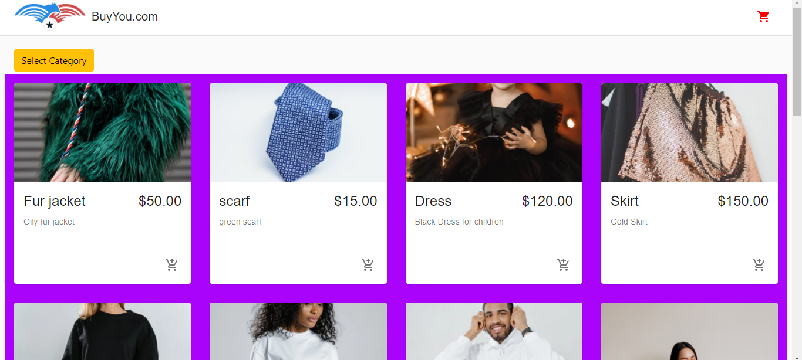
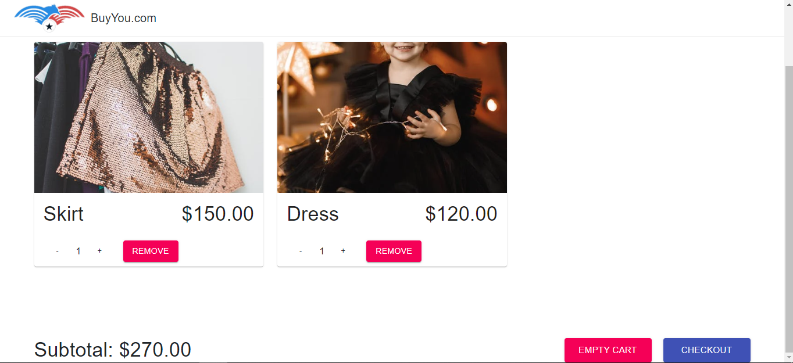
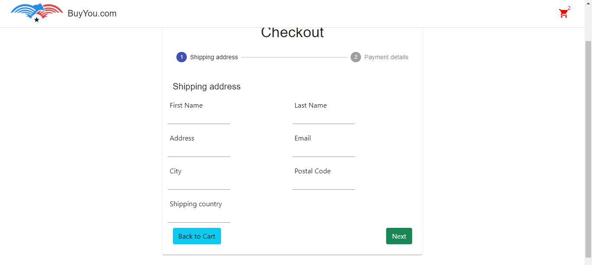
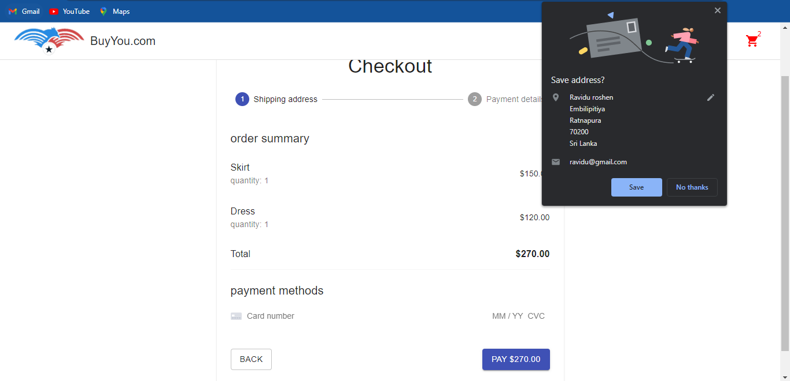
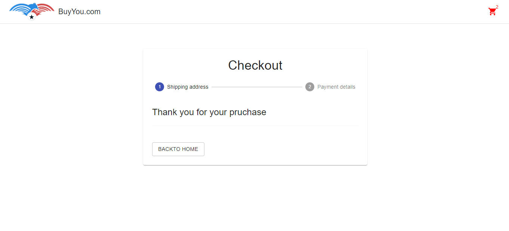

## E commerce Web site

This project is a e-commerce application that developed on react.
From this, can be viewed specific products by selecting categories.
After that, we can add to the cart if we interest to it. We can checkout orders by filling the shipping details and payement method.

This site in development progress.

## Getting Started with Create React App

This project was bootstrapped with [Create React App](https://github.com/facebook/create-react-app).

## Install

Clone the code by opening shell in specific folder.

```shell
git clone <github Code Link>
```

To install dependencies.

```shell
npm install
```

Then start by.

```shell
npm start
```

## Sample Usage

<table>
  <tr>
    <td></td>
  </tr>
  <tr>
    <td></td>
  </tr>
  <tr>
    <td></td>
  </tr>
  <tr>
    <td></td>
  </tr>
    <tr>
    <td></td>
  </tr>
  <tr>
    <td></td>
  </tr>
 </table>
